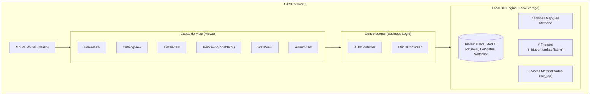

# 🎬 CineClassify Pro

<div align="center">


**Plataforma Web Profesional para Clasificar, Valorar, Gestionar y Crear Tier Lists de Películas y Series.**

[🚀 Características](#-características-principales) • [🖼️ Vista Previa del Sistema](#-vista-previa-del-sistema) • [🛠️ Arquitectura Técnica](#%EF%B8%8F-arquitectura-t%C3%A9cnica) • [📦 Instalación y Uso](#-instalaci%C3%B3n-y-uso) • [🔑 Usuarios de Prueba](#-usuarios-de-prueba)

---

</div>

## 📌 Descripción General

**CineClassify Pro** es una aplicación web SPA (*Single Page Application*) desarrollada en JavaScript Moderno (ES6+) con arquitectura MVC y un motor de base de datos relacional simulado sobre `LocalStorage`. 

Ofrece una experiencia fluida, rápida e intuitiva para los amantes del cine y las series, permitiendo descubrir producciones, llevar un seguimiento de visualización (*Watch Status*), calificar contenidos, publicar reseñas, armar listas de seguimiento (*Watchlist*) y clasificar títulos en un **Creador de Tier Lists** interactivo mediante arrastrar y soltar (*Drag & Drop*).

---

## 🖼️ Vista Previa del Sistema

A continuación se presenta la vista estructural de las pantallas principales del sistema:

### 1. 🏠 Inicio y Dashboard Editorial (`#home`)
```
+-----------------------------------------------------------------------------------+
|  🎬 CineClassify Pro    [🔍 Buscar...]  [🏠 Inicio] [🍿 Catálogo] [🏆 Tier List]  |
+-----------------------------------------------------------------------------------+
|  HERO BANNER DESTACADO                                                            |
|  +-----------------------------------------------------------------------------+  |
|  |  🍿 PELÍCULA DESTACADA DEL MES                                              |  |
|  |  Interstellar (2014) • Sci-Fi / Drama • ⭐ 9.8 / 10                           |  |
|  |  "Un viaje a través de un agujero de gusano para salvar a la humanidad..."     |  |
|  |  [▶️ Ver Tráiler] [➕ Añadir a Watchlist] [⭐ Calificar]                        |  |
|  +-----------------------------------------------------------------------------+  |
|                                                                                   |
|  🔥 Top Películas Mejor Valoradas                  🔥 Series Tendencia            |
|  +--------+  +--------+  +--------+            +--------+  +--------+           |
|  | 🍿 9.8 |  | 🍿 9.5 |  | 🍿 9.2 |            | 📺 9.6 |  | 📺 9.4 |           |
|  | Incept.|  | Padrino|  | Matrix |            | Arcane |  | B. Bad |           |
|  +--------+  +--------+  +--------+            +--------+  +--------+           |
+-----------------------------------------------------------------------------------+
```

### 2. 🍿 Catálogo con Filtros Avanzados (`#catalog`)
```
+-----------------------------------------------------------------------------------+
|  FILTROS DE BÚSQUEDA                                                              |
|  [ Tipo: Todos ▾ ] [ Género: Sci-Fi ▾ ] [ Año: Todos ▾ ] [ Ordenar: Calificación ▾] |
|                                                                                   |
|  GRID DE CONTENIDOS (12 por página)                                               |
|  +-------------------+  +-------------------+  +-------------------+              |
|  | 🎬 INTERSTELLAR   |  | 🎬 THE MATRIX     |  | 📺 ARCANE         |              |
|  | Año: 2014         |  | Año: 1999         |  | Año: 2021         |              |
|  | ⭐ 9.8 (124 rev)  |  | ⭐ 9.5 (98 rev)   |  | ⭐ 9.7 (210 rev)  |              |
|  | Status: [Vista ▾] |  | Status: [En Proceso]| Status: [No Vista] |              |
|  +-------------------+  +-------------------+  +-------------------+              |
|                                                                                   |
|  [⏮️ Anterior]                    Página 1 de 3                    [Siguiente ⏭️] |
+-----------------------------------------------------------------------------------+
```

### 3. 🏆 Creador de Tier List Drag & Drop (`#tierlist`)
```
+-----------------------------------------------------------------------------------+
|  🏆 CREADOR DE TIER LISTS INTERACTIVO                                            |
|  Arrastra los posters de películas/series a las categorías correspondientes:     |
|                                                                                   |
|  [ Tier S - Obras Maestras ] -> [ 🎬 Inception ] [ 🎬 El Padrino ]                |
|  [ Tier A - Excelentes     ] -> [ 🎬 Interstellar ] [ 📺 Arcane ]                 |
|  [ Tier B - Buenas         ] -> [ 🎬 Avengers: Endgame ]                         |
|  [ Tier C - Regulares      ] -> [ 🎬 La Quinta Ola ]                              |
|  [ Tier D - No recomendadas] -> (Arrastra elementos aquí...)                      |
|                                                                                   |
|  📦 BANCO DE CONTENIDOS SIN CLASIFICAR                                           |
|  [ 🎬 Matrix ] [ 📺 Breaking Bad ] [ 📺 Stranger Things ]                         |
|                                                                                   |
|  [💾 Guardar mi Tier List] [🔄 Reiniciar]                                         |
+-----------------------------------------------------------------------------------+
```

### 4. 📑 Vista de Detalle, Tráiler y Reseñas (`#detail/:id`)
```
+-----------------------------------------------------------------------------------+
|  <- Volver al Catálogo                                                            |
|  +--------------+  INTERSTELLAR (2014)                                            |
|  |              |  Director: Christopher Nolan                                    |
|  |    POSTER    |  Duración: 169 min | Clasificación: PG-13 | Calificación: ⭐ 9.8   |
|  |    IMAGEN    |  Géneros: Sci-Fi, Drama                                         |
|  |              |  [▶️ Ver Tráiler Modal] [➕ Mi Watchlist]                        |
|  +--------------+                                                                 |
|                                                                                   |
|  SINOPSIS                                                                         |
|  Un grupo de exploradores viaja a través de un agujero de gusano espacial...      |
|                                                                                   |
|  EVALUACIÓN Y RESEÑA DE COMUNIDAD                                                 |
|  [ Tu Valoración: ⭐⭐⭐⭐⭐⭐⭐⭐⭐⭐ 10/10 ]                                     |
|  [ Escribe tu comentario...] -> [ Publicar Reseña ]                               |
|                                                                                   |
|  💬 Reseñas Recientes:                                                            |
|  • @cinefilo99 (⭐ 10/10): "Una obra maestra de la ciencia ficción moderna."      |
|  • @maria_g   (⭐ 9/10):  "La banda sonora de Hans Zimmer es increíble."          |
+-----------------------------------------------------------------------------------+
```

### 5. 🛡️ Panel de Administración (`#admin`)
```
+-----------------------------------------------------------------------------------+
|  ⚙️ PANEL DE CONTROL DE ADMINISTRADOR                                             |
|  [📊 Métricas Glob.] [🍿 Gestionar Películas/Series] [👥 Gestionar Usuarios]     |
|                                                                                   |
|  NUEVA PELÍCULA/SERIE                                                             |
|  Título: [__________________]  Año: [2024]  Tipo: (x) Película ( ) Serie           |
|  Director: [________________]  Duración: [______]  Imagen URL: [_______________]  |
|  Sinopsis: [__________________________________________________________________]  |
|  [ 💾 Guardar Contenido ]                                                         |
|                                                                                   |
|  TABLA DE CONTENIDOS EXISTENTES                                                   |
|  ID      | Título        | Tipo     | Año  | Rating | Acciones                    |
|  #m001   | Interstellar  | Película | 2014 | ⭐ 9.8 | [✏️ Editar] [🗑️ Eliminar]   |
|  #m002   | The Matrix    | Película | 1999 | ⭐ 9.5 | [✏️ Editar] [🗑️ Eliminar]   |
+-----------------------------------------------------------------------------------+
```

---

## 🚀 Características Principales

- 🎯 **Navegación SPA (Single Page Application):** Enrutador por Hash sin recarga de página (`#home`, `#catalog`, `#tierlist`, `#stats`, `#admin`).
- 💾 **Motor DB Relacional Simulado:**
  - Estructura normalizada en **3ª Forma Normal (3FN)**.
  - **Triggers automáticos** para el cálculo dinámico de puntuación media y contador de reseñas.
  - **Vistas Materializadas** para tops en tiempo real (`mv_top_movies`, `mv_top_series`).
  - **Índices en memoria** basados en `Map()` para búsquedas ultra rápidas O(1).
- 🏆 **Creador de Tier Lists Drag & Drop:** Clasificación en niveles S, A, B, C, D impulsada por `SortableJS` con persistencia de estado por usuario.
- 🔍 **Búsqueda Avanzada y Filtros:** Búsqueda Full-Text por título, sinopsis, director y actores, combinable por género, año y valoración mínima.
- 👤 **Sistema de Autenticación y Roles:** 
  - Gestión de usuarios y sesiones.
  - Control de Acceso Basado en Roles (RBAC: *Admin* y *User*).
- 🎬 **Seguimiento de Visualización (Watch Status):** Estado por contenido (*No vista*, *En proceso*, *Vista*).
- 📈 **Panel de Analíticas:** Estadísticas globales de la plataforma con gráficos y métricas cuantitativas.
- 🎨 **Diseño Moderno & Oscuro:** Interfaz limpia con tipografía *Outfit*, diseño responsivo y efectos visuales modernos.

---

## 🛠️ Arquitectura Técnica

El proyecto está construido bajo el patrón **MVC (Modelo-Vista-Controlador)** en una arquitectura limpia y modular dentro de JavaScript nativo:



---

## 📦 Instalación y Uso

### Requisitos Previos
- Cualquier navegador web moderno (Chrome, Edge, Firefox, Safari).
- Node.js (opcional, solo para servidor de desarrollo local).

### Pasos de Ejecución

1. **Clonar el repositorio:**
   ```bash
   git clone https://github.com/calomixx/classycine.git
   cd classycine
   ```

2. **Ejecutar servidor local:**
   Puedes iniciar un servidor ligero ejecutando:
   ```bash
   npm start
   ```
   *O alternativamente abrir directamente el archivo `index.html` en tu navegador.*

3. **Acceder a la aplicación:**
   Navega a `http://localhost:3000` en tu navegador.

---

## 🔑 Usuarios de Prueba

El sistema cuenta con datos iniciales (*Seed*) cargados automáticamente:

| Rol | Usuario | Contraseña | Permisos |
| :--- | :--- | :--- | :--- |
| 🛡️ **Administrador** | `admin` | `admin123` | Acceso total al panel de administración, gestión de usuarios y CRUD de catálogo. |
| 👤 **Usuario Estándar** | `demo` | `demo123` | Calificar, publicar reseñas, modificar Watchlist, estado de visualización y Tier List. |

---

## 📜 Licencia

Este proyecto está bajo la Licencia MIT. ¡Siéntete libre de modificarlo y mejorarlo!
